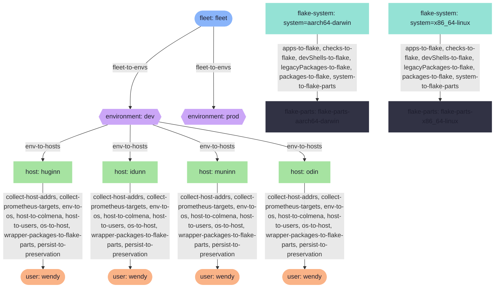
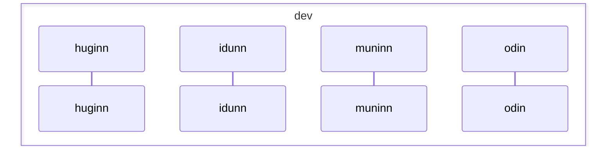

# Fleet Topology

Auto-generated visualizations of the nix-config fleet's
aspect-resolution pipeline, scope tree, and data flow.

## Scope Topology

```mermaid
graph TD
  accessGroups__list_accessGroups__environment_dev_fleet_fleet_host_huginn["host: huginn"]
  accessGroups__list_accessGroups__environment_dev_fleet_fleet_host_huginn_user_wendy(["user: wendy"])
  accessGroups__list_accessGroups__environment_dev_fleet_fleet_host_idunn["host: idunn"]
  accessGroups__list_accessGroups__environment_dev_fleet_fleet_host_idunn_user_wendy(["user: wendy"])
  accessGroups__list_accessGroups__environment_dev_fleet_fleet_host_muninn["host: muninn"]
  accessGroups__list_accessGroups__environment_dev_fleet_fleet_host_muninn_user_wendy(["user: wendy"])
  accessGroups__list_accessGroups__environment_dev_fleet_fleet_host_odin["host: odin"]
  accessGroups__list_accessGroups__environment_dev_fleet_fleet_host_odin_user_wendy(["user: wendy"])
  environment_dev_fleet_fleet[["environment: dev"]]
  environment_prod_fleet_fleet[["environment: prod"]]
  flake_parts_flake_parts_aarch64_darwin_system_aarch64_darwin["flake-parts: flake-parts-aarch64-darwin"]
  flake_parts_flake_parts_x86_64_linux_system_x86_64_linux["flake-parts: flake-parts-x86_64-linux"]
  fleet_fleet(["fleet: fleet"])
  system_aarch64_darwin["flake-system: system=aarch64-darwin"]
  system_x86_64_linux["flake-system: system=x86_64-linux"]

  environment_dev_fleet_fleet --> accessGroups__list_accessGroups__environment_dev_fleet_fleet_host_huginn
  accessGroups__list_accessGroups__environment_dev_fleet_fleet_host_huginn --> accessGroups__list_accessGroups__environment_dev_fleet_fleet_host_huginn_user_wendy
  environment_dev_fleet_fleet --> accessGroups__list_accessGroups__environment_dev_fleet_fleet_host_idunn
  accessGroups__list_accessGroups__environment_dev_fleet_fleet_host_idunn --> accessGroups__list_accessGroups__environment_dev_fleet_fleet_host_idunn_user_wendy
  environment_dev_fleet_fleet --> accessGroups__list_accessGroups__environment_dev_fleet_fleet_host_muninn
  accessGroups__list_accessGroups__environment_dev_fleet_fleet_host_muninn --> accessGroups__list_accessGroups__environment_dev_fleet_fleet_host_muninn_user_wendy
  environment_dev_fleet_fleet --> accessGroups__list_accessGroups__environment_dev_fleet_fleet_host_odin
  accessGroups__list_accessGroups__environment_dev_fleet_fleet_host_odin --> accessGroups__list_accessGroups__environment_dev_fleet_fleet_host_odin_user_wendy
  fleet_fleet --> environment_dev_fleet_fleet
  fleet_fleet --> environment_prod_fleet_fleet
  system_aarch64_darwin --> flake_parts_flake_parts_aarch64_darwin_system_aarch64_darwin
  system_x86_64_linux --> flake_parts_flake_parts_x86_64_linux_system_x86_64_linux

  style accessGroups__list_accessGroups__environment_dev_fleet_fleet_host_huginn fill:#a6e3a1,stroke:#a6e3a1,color:#1e1e2e
  style accessGroups__list_accessGroups__environment_dev_fleet_fleet_host_huginn_user_wendy fill:#fab387,stroke:#fab387,color:#1e1e2e
  style accessGroups__list_accessGroups__environment_dev_fleet_fleet_host_idunn fill:#a6e3a1,stroke:#a6e3a1,color:#1e1e2e
  style accessGroups__list_accessGroups__environment_dev_fleet_fleet_host_idunn_user_wendy fill:#fab387,stroke:#fab387,color:#1e1e2e
  style accessGroups__list_accessGroups__environment_dev_fleet_fleet_host_muninn fill:#a6e3a1,stroke:#a6e3a1,color:#1e1e2e
  style accessGroups__list_accessGroups__environment_dev_fleet_fleet_host_muninn_user_wendy fill:#fab387,stroke:#fab387,color:#1e1e2e
  style accessGroups__list_accessGroups__environment_dev_fleet_fleet_host_odin fill:#a6e3a1,stroke:#a6e3a1,color:#1e1e2e
  style accessGroups__list_accessGroups__environment_dev_fleet_fleet_host_odin_user_wendy fill:#fab387,stroke:#fab387,color:#1e1e2e
  style environment_dev_fleet_fleet fill:#cba6f7,stroke:#cba6f7,color:#1e1e2e
  style environment_prod_fleet_fleet fill:#cba6f7,stroke:#cba6f7,color:#1e1e2e
  style flake_parts_flake_parts_aarch64_darwin_system_aarch64_darwin fill:#313244,stroke:#313244,color:#1e1e2e
  style flake_parts_flake_parts_x86_64_linux_system_x86_64_linux fill:#313244,stroke:#313244,color:#1e1e2e
  style fleet_fleet fill:#89b4fa,stroke:#89b4fa,color:#1e1e2e
  style system_aarch64_darwin fill:#94e2d5,stroke:#94e2d5,color:#1e1e2e
  style system_x86_64_linux fill:#94e2d5,stroke:#94e2d5,color:#1e1e2e
```

## Policy Resolution

## Pipe Flow

## Pipe Sequence

## Fleet Summary

# Fleet Summary

## Topology

- **2** environments, **4** hosts, **4** users
- Scope chain: flake → fleet → user → host → environment → flake-system → flake-parts
- Trace entries: 532

## Environments

| Environment | Hosts | Host Count | Users |
| ------------- | ------- | ------------ | ------- |
| dev | huginn, idunn, muninn, odin | 4 | 4 |
| prod |  | 0 | 0 |

## Aspects by Host

| Host | Aspect Count | Aspects |
| ------ | -------------- | --------- |
| huginn | 7 | host/resolve(base.cli._), host/resolve(preservation), host/resolve(terminal), huginn, insecure-predicate/os, iso, unfree-predicate/os |
| idunn | 3 | host/resolve(base.cli._), host/resolve(terminal), theming |
| muninn | 6 | host/resolve(base.cli._), host/resolve(preservation), host/resolve(terminal), insecure-predicate/os, muninn, unfree-predicate/os |
| odin | 8 | host/resolve(base.cli._), host/resolve(preservation), host/resolve(terminal), insecure-predicate/os, nvidia, odin, theming, unfree-predicate/os |

## Pipes

| Pipe | Scope Boundary | Producers | Collectors |
| ------ | ---------------- | ----------- | ------------ |
| colmena | environment: dev | huginn, idunn, muninn, odin |  |
| env | environment: dev | huginn, idunn, muninn, odin |  |
| os | environment: dev | huginn, idunn, muninn, odin |  |
| persist | environment: dev | huginn, idunn, muninn, odin |  |
| pihole | environment: dev | huginn, muninn |  |
| services | environment: dev | huginn, muninn |  |
| wrapper-packages | environment: dev | huginn, idunn, muninn, odin |  |
| host-addrs | environment: dev |  | huginn, idunn, muninn, odin |
| prometheus-targets | environment: dev |  | huginn, idunn, muninn, odin |

## Policies

| Policy | Fires at |
| -------- | ---------- |
| flake-to-systems | flake |
| to-fleet | flake |
| apps-to-flake | flake-system |
| checks-to-flake | flake-system |
| devShells-to-flake | flake-system |
| legacyPackages-to-flake | flake-system |
| packages-to-flake | flake-system |
| system-to-flake-parts | flake-system |
| devshell-to-flake-parts | flake-parts |
| fleet-to-envs | fleet |
| env-to-hosts | environment |
| collect-host-addrs | host |
| collect-prometheus-targets | host |
| env-to-os | host |
| host-to-colmena | host |
| host-to-users | host |
| os-to-host | host |
| wrapper-packages-to-flake-parts | host |
| hjem-user-detect | user |
| hjemDarwin-to-hjem | user |
| user-to-host | user |
| persist-to-preservation | host |
| hjemLinux-to-hjem | user |
| persist-user-to-preservation | user |
